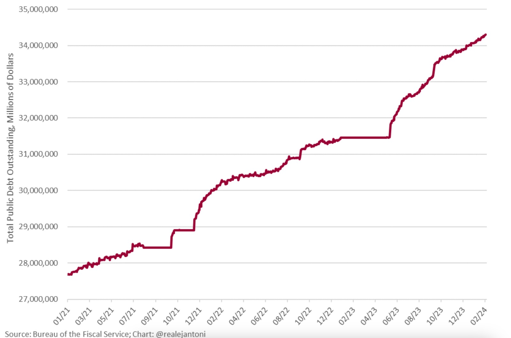
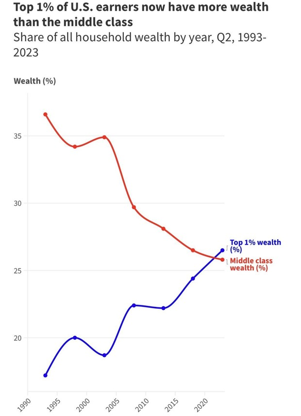
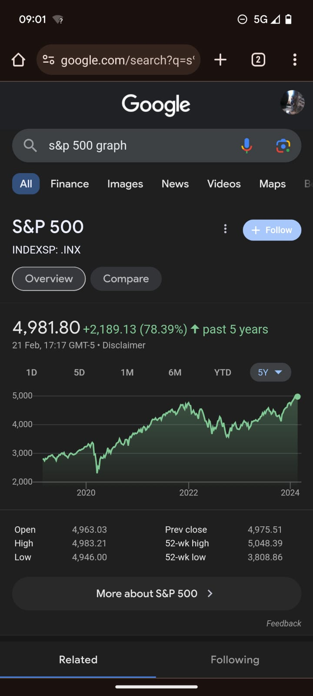

## the wealth gap

The government has printed a lot of money for various reasons:

The wealth gap has grown a lot:

These are probably bad things.

The S&P 500 over 5 years looks very healthy:

That is because, the rich will buy assets with their money, which is why house prices and stock prices go up and everyone thinks the economy is doing well.

When the government prints money (like they have done to pay for Covid), it ends up in the hands of rich people, who buy assets with it.  As they do this, the price of shares and houses (i.e. assets) goes up.

The [@garyseconomics](https://www.youtube.com/@garyseconomics) youtube channel explains this all very well.

Do you think this is a problem? How shoud we solve it? Is it to tax the rich?